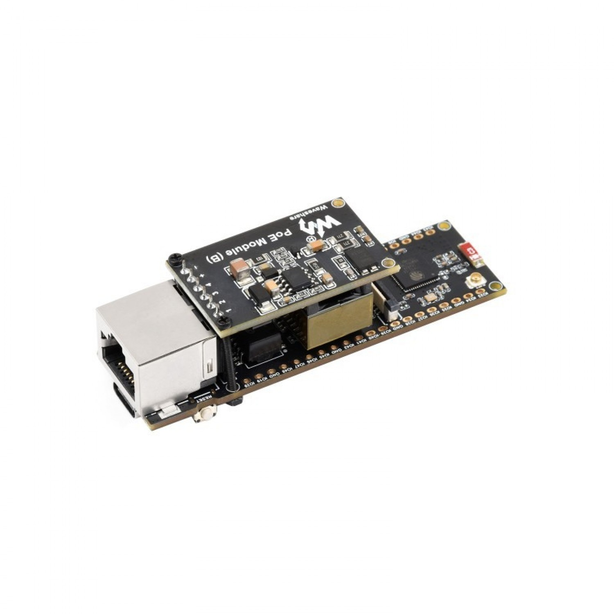
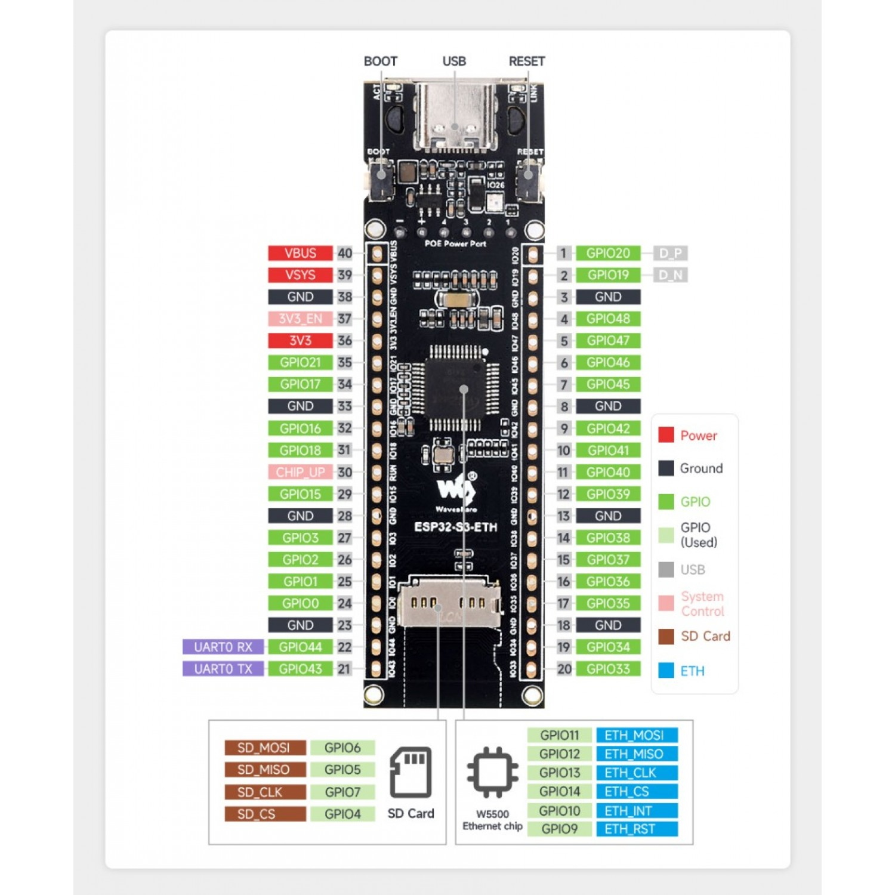

# HDC Sense & Control Node

**Unified SNMP-enabled ESP32 PoE firmware** for environmental monitoring and control.

## Overview

This firmware is designed for the **ESP32-S3 ETH with PoE** development board.

- Temperature and humidity monitoring via SHT31 (I2C)
- Airflow sensing via Omron D6F-V03A1 analog input
- Contact status monitoring (2× digital dry inputs)
- Relay control outputs (2×)
- SNMPv2c support for GET/SET
- System uptime & hardware info reporting
- Static IP with DHCP fallback
- Zabbix-ready template & MIB

## Hardware

| Component          | Description                        |
|--------------------|------------------------------------|
| **Board**          | ESP32-S3 ETH                     |
| **Temp Sensor**    | SHT31 (I2C addr: `0x44`)           |
| **Airflow Sensor** | Omron D6F-V03A1 → GPIO 34 (ADC)    |
| **Inputs**         | GPIO 32, 33 (Contact Closure)      |
| **Relays**         | GPIO 25, 26                        |
| **I2C Pins**       | SDA: GPIO 21, SCL: GPIO 22         |

### ESP32-S3 ETH with PoE (Front View)



> *This board features an ESP32-S3 microcontroller, onboard LAN8720 Ethernet PHY, and optional Power-over-Ethernet (PoE) support.*

### ESP32-S3 ETH with PoE Pinout



> *This pinout diagram identifies key GPIOs including I2C, analog inputs, and relay control lines used in this project.*

## SNMP OIDs

| OID                          | Description                          |
|------------------------------|--------------------------------------|
| `.1.3.6.1.4.1.55555.1.1.0`    | Temperature (°C ×100)                |
| `.1.3.6.1.4.1.55555.1.1.1`    | Temperature (°F ×100)                |
| `.1.3.6.1.4.1.55555.1.2.0`    | Humidity (%RH ×100)                 |
| `.1.3.6.1.4.1.55555.1.3.0`    | Airflow voltage ×1000               |
| `.1.3.6.1.4.1.55555.1.4.0`    | Relay 1 (R/W)                       |
| `.1.3.6.1.4.1.55555.1.5.0`    | Relay 2 (R/W)                       |
| `.1.3.6.1.4.1.55555.1.6.0`    | Contact Input 1                     |
| `.1.3.6.1.4.1.55555.1.7.0`    | Contact Input 2                     |
| `.1.3.6.1.4.1.55555.1.8.0`    | System Uptime (ms)                  |
| `.1.3.6.1.4.1.55555.1.9.0`    | Node Name                           |
| `.1.3.6.1.4.1.55555.1.10.0`   | Software Version                    |
| `.1.3.6.1.4.1.55555.1.11.0`   | Chip Model                          |
| `.1.3.6.1.4.1.55555.1.12.0`   | Chip Revision                       |
| `.1.3.6.1.4.1.55555.1.13.0`   | CPU Core Count                      |
| `.1.3.6.1.4.1.55555.1.14.0`   | Flash Size (Bytes)                  |
| `.1.3.6.1.4.1.55555.1.15.0`   | MAC Address                         |

## PlatformIO Configuration

```ini
[env:esp32dev]
platform = espressif32
board = esp32-s3-devkitc-1
framework = arduino
monitor_speed = 115200
upload_speed = 921600

lib_deps =
  adafruit/Adafruit SHT31 Library@^2.2.0
  adafruit/Adafruit BusIO@^1.14.2

build_flags =
  -D ETH_CLK_MODE=ETH_CLOCK_GPIO17_OUT
  -D ETH_PHY_POWER=12
  -D ETH_TYPE=ETH_PHY_LAN8720
  -D ETH_ADDR=1
  -D ETH_MDC=23
  -D ETH_MDIO=18
```

## SNMP Community Configuration

```cpp
#define SNMP_COMMUNITY_READ  "public"
#define SNMP_COMMUNITY_WRITE "private"
```

## Zabbix Integration

A ready-to-import YAML template is included:

```text
zabbix/hdc-sense-control-template.yml
```

Includes:

- Item prototypes for all SNMP metrics
- Discovery rules for relays and contact sensors
- Graphs and triggers

## Build & Flash

```bash
# Build firmware
platformio run

# Upload to device
platformio run --target upload

# Monitor serial output
platformio device monitor
```

## License

MIT License  
© 2025 Halton Datacenter — Antoine Boucher.
